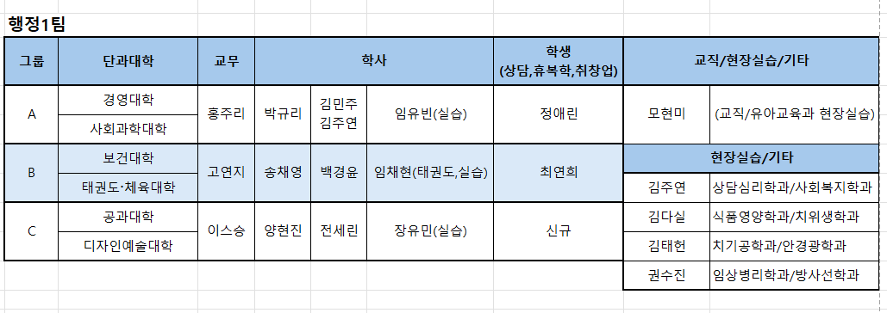

<!-- _class: lead -->
<!-- _paginate: false -->
<!-- _header: "" -->

# 업무중심 체제 전환 계획안

**신한대학교 교무처 행정1팀**

2026. 3. 19.

---

## Ⅰ. 추진 배경

□ **현행 운영 체계**
- 행정1팀 직원 22명이 A·B·C 3개 그룹으로 편성되어 배정 학과의 학사·교무·학생·교직·현장실습 등 전 업무를 통합 처리하는 **학과담당제** 운영 중
- 2026. 3. 1. 통합행정실 → 행정1팀으로 개편, 6개 대학(학부) 담당

□ **전환 필요성**
- 동일 직원이 여러 업무 분야를 동시 처리함에 따라 특정 분야 전문성 제고에 한계
- 결원·인사이동 발생 시 담당 학과 전체 업무 공백 우려 및 인수인계 복잡성 증가
- 교직·현장실습 등 전문성이 요구되는 분야에 대한 안정적 대응 체계 필요

---

## Ⅱ. 현황 및 문제점

### 현행 학과담당제 구조

| 구분 | 담당 대학(학부) | 인원 |
|------|----------------|------|
| A그룹 | 경영대학, 사회과학대학 | 7명 |
| B그룹 | 보건대학, 태권도학부, 체육대학 | 8명 |
| C그룹 | 공과대학, 디자인예술대학 | 7명 |
| **합계** | **6개 대학(학부)** | **22명** (공석 3명 포함) |

---

## Ⅱ. 현황 및 문제점 (계속)

### 그룹별 업무분장 현황

---

## Ⅱ. 현황 및 문제점 (계속)

### 주요 문제점

□ **전문성 분산**
학사·교무·학생·교직·현장실습·기타 6개 분야 업무가 1인에게 집중되어 분야별 전문 역량 축적 곤란

□ **업무 연속성 취약**
인사이동·결원 발생 시 특정 학과 전체 업무 동시 공백, 인수인계 범위 과다

□ **효율성 저하**
유사·반복 업무의 그룹 간 분산 처리로 표준화 및 시스템화 지연

---

## Ⅲ. 전환 방안

### 업무 6개 분야 편성

| 분야 | 주요 업무 내용 |
|------|--------------|
| **학사** | 수강신청, 성적처리, 졸업사정, 학적관리 |
| **교무** | 강의계획서, 강사 임용, 교과과정, 교원업적 |
| **학생** | 장학, 학생상담, 학생행사, 생활지도 |
| **교직** | 교직이수, 교생실습, 교원자격증 발급 |
| **현장실습** | 현장실습 신청·관리, 협약기관 연계 |
| **기타** | 민원, 증명서 발급, 공문 접수·처리 |

---

## Ⅲ. 전환 방안 (계속)

### 그룹별 업무중심 편성(안)

| 그룹 | 담당 대학(학부) | 업무 분야 배치 |
|------|----------------|--------------|
| **A그룹** | 경영대학, 사회과학대학 | 학사·교무·학생·교직·현장실습·기타 |
| **B그룹** | 보건대학, 태권도학부, 체육대학 | 학사·교무·학생·교직·현장실습·기타 |
| **C그룹** | 공과대학, 디자인예술대학 | 학사·교무·학생·교직·현장실습·기타 |

> ※ 각 그룹 내에서 직원별로 **1~2개 분야 전담**하되, 그룹 간 동일 분야 담당자 간 상시 협업 및 정보 공유 체계 운영

---

## Ⅲ. 전환 방안 (계속)

### 기대 효과

○ 분야별 전문성 집중 강화 및 업무처리 속도 향상

○ 결원·이동 발생 시 동일 분야 타 그룹 직원의 즉시 보완 가능

○ 분야별 업무 표준화·매뉴얼화로 인수인계 부담 경감

○ 학생·교원 민원 응대 품질 향상

---

## Ⅳ. 추진 일정

| 추진 사항 | 일정 | 담당 |
|----------|------|------|
| 업무분장표(안) 작성 및 협의 | 2026. 3월 | 팀장 |
| 그룹별 업무 배분 확정 | 2026. 4월 | 전체 |
| 분야별 인수인계 완료 | 2026. 4월 | 각 그룹장 |
| 전결권 위임 규정 정비 | 2026. 4월 | 팀장 |
| 업무 매뉴얼 구축 | 2026. 상반기 | 분야별 담당 |
| 운영 결과 점검·보완 | 2026. 하반기 | 팀장 |

---

## Ⅴ. 협조 및 건의 사항

○ 공석 3명(이남헌·황은하·김소희) 조기 충원 요청
  — 전환 초기 업무 분야별 공백 최소화 필요

○ 교직·현장실습 분야 외부 연수 지원
  — 전문성 확보를 위한 분야별 역량 강화 교육 연계

○ 분야 전담 체제 안착 시까지 한시적 병행 운영(학과담당 병행) 검토

---

<!-- _class: lead -->

## 감사합니다

> **붙임** 1. 업무분장표(안)  1부
> **붙임** 2. 그룹별 담당 학과 현황  1부
